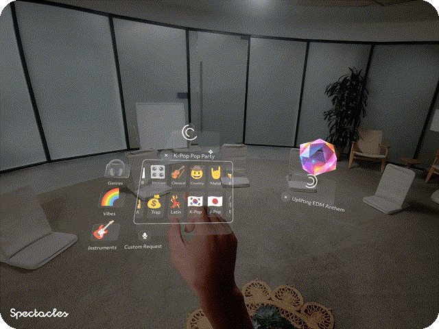

# AI Music Gen

[](https://developers.snap.com/spectacles/spectacles-frameworks/spectacles-interaction-kit/features/overview) [](https://developers.snap.com/spectacles/about-spectacles-features/apis/remoteservice-gateway) [](https://developers.snap.com/spectacles/about-spectacles-features/compatibility-list) [](https://developers.snap.com/spectacles/about-spectacles-features/compatibility-list) [](https://developers.snap.com/spectacles/about-spectacles-features/apis/snap3d) [](https://developers.snap.com/spectacles/about-spectacles-features/compatibility-list) [](https://developers.snap.com/lens-studio/features/audio/playing-audio) [](https://developers.snap.com/spectacles/spectacles-frameworks/spectacles-ui-kit)



## Overview

This sample demonstrates how to generate AI music on Specs using Google's Lyria model via Remote Service Gateway. Users combine genres, vibes, and instruments through a hand-docked menu to create custom music tracks, with each track accompanied by a matching 3D visualization generated by Snap3D. Generated tracks are persisted and served through [Snap Cloud](https://developers.snap.com/spectacles/about-spectacles-features/apis/snap-cloud) (Storage + an Edge Function). Learn more about the [Remote Service Gateway API](https://developers.snap.com/spectacles/about-spectacles-features/apis/remoteservice-gateway).

> **NOTE**: This project will only work for the Specs platform. You must set the simulation mode in the Lens Studio Preview panel to `Specs (2024)`. You must also provide your own Remote Service Gateway Key and a Snap Cloud project to use the AI features in this project.

## How It Works

```
Lens ──RSG Gemini endpoint──▶ Gemini (prompt + title) ──▶ lyria-3-clip-preview ──▶ 30s MP3 (base64, ~1MB)
  │
  ├─ 1. Base64.decode → upload MP3 to Snap Cloud Storage          (track persisted)
  │
  ├─ 2. POST /functions/v1/transcode-to-wav {bucket, path}        (MP3 → WAV, server-side)
  │
  └─ 3. WAV public URL → RemoteMediaModule.loadResourceAsAudioTrackAsset → AudioComponent
```

1. **Generate** — Gemini condenses the user's genre/vibe/instrument selections into one optimized Lyria prompt, then Lyria 3 (`lyria-3-clip-preview`, served through the same Remote Service Gateway `generateContent` endpoint as Gemini) returns a 30-second MP3 as inline base64. The clip model stays under the 4MB RemoteApi message limit on device; Lyria-002's ~8MB inline WAV does not.
2. **Store** — the lens decodes the base64 and uploads the MP3 to a Snap Cloud Storage bucket. The storage round-trip is required: Lens Studio has no runtime API to turn raw audio bytes into a playable asset, but `RemoteMediaModule` can load one from a URL.
3. **Transcode** — a Snap Cloud Edge Function converts the MP3 to WAV. This step is what makes playback work **on device**: SnapOS cannot decode MP3 at runtime (the track loads and "plays" but produces zero audio samples — silent on device, while the editor decodes MP3 fine and masks the issue). WAV plays correctly through the same pipeline. Lyria 3 offers no output-format option, so the conversion happens server-side.
4. **Play** — the lens loads the WAV through `RemoteMediaModule.loadResourceAsAudioTrackAsset` and plays it with an `AudioComponent`.

See [SnapCloud-Music-Setup.md](./Assets/Scripts/SnapCloud-Music-Setup.md) for the full background and design notes.

## Design Guidelines

Designing Lenses for Specs offers all-new possibilities to rethink user interaction with digital spaces and the physical world.
Get started using our [Design Guidelines](https://developers.snap.com/spectacles/best-practices/design-for-spectacles/introduction-to-spatial-design)

## Prerequisites

- **Lens Studio**: v5.15.4+

**Note:** Ensure Lens Studio is [compatible with Specs](https://ar.snap.com/download) for your Specs device and OS versions.

- **Specs OS Version**: v5.64+
- **Specs App iOS**: v0.64+
- **Specs App Android**: v0.64+


To update your Specs device and mobile app, please refer to this [guide](https://support.spectacles.com/hc/en-us/articles/30214953982740-Updating).

You can download the latest version of Lens Studio from [here](https://ar.snap.com/download?lang=en-US).

## Getting Started

To obtain the project folder, clone the repository.

> **IMPORTANT:**
> This project uses Git Large Files Support (LFS). Downloading a zip file using the green button on GitHub **will not work**. You must clone the project with a version of git that has LFS.
> You can download Git LFS [here](https://git-lfs.github.com/).

## Initial Project Setup

The project should be pre-configured to get you started without any additional steps. However, if you encounter issues in the Logger Panel, please ensure your Lens Studio environment is set up for [Specs](https://developers.snap.com/spectacles/get-started/start-buiding/preview-panel).

To enable AI features you must configure a Remote Service Gateway token:

1. Install the Remote Service Gateway Token Generator plug-in from the Asset Browser.
2. Go to **Window > Remote Service Gateway Token**.
3. Click **Generate Token**.
4. Copy and paste the token into the `RemoteServiceGatewayCredentials` object in the Inspector.

## Snap Cloud Setup

The music pipeline needs three things in your Snap Cloud project: imported credentials, a storage bucket, and the transcode Edge Function.

### 1. Credentials

1. Go to **Window > Supabase** in Lens Studio and log in.
2. Select your Snap Cloud project and click **Import Credentials** — this fills the `SupabaseProject` asset.
3. Make sure the asset is assigned to the `SnapCloudRequirements` component in the scene.

Credentials live in your local plugin session, not in version control — re-import them if the lens logs `supabaseUrl is required`.

### 2. Storage bucket

Create a bucket named `generated-music` (Dashboard → **Storage** → **New bucket**) and make it **public**.

- **Why public?** Playback on device uses the short public URL. A private bucket would require a signed URL, and a signed URL's ~300-character JWT exceeds the 255-byte filename limit SnapOS uses for its download cache — the download fails with `ENAMETOOLONG` before any network request happens.
- Tracks accumulate as `music/track_<timestamp>.mp3` plus the `track_<timestamp>.wav` the Edge Function writes next to it (~5–6MB per 30s clip — the WAV is what the lens actually plays).

### 3. Storage policies

The lens signs in with the Snapchat provider (`signInWithIdToken`), so uploads run as the `authenticated` role. Public buckets allow reads, but inserts still need a policy (Dashboard → **Storage** → **Policies**, or SQL editor):

```sql
create policy "authenticated can upload music"
on storage.objects for insert to authenticated
with check (bucket_id = 'generated-music');
```

The Edge Function itself uses the service role and bypasses these policies.

### 4. Edge Function

Deploy [`SnapCloud/functions/transcode-to-wav/index.ts`](./SnapCloud/functions/transcode-to-wav/index.ts) — either paste it in the Dashboard (**Edge Functions** → new function, named exactly `transcode-to-wav`) or via CLI (`supabase functions deploy transcode-to-wav`). No extra secrets needed: `SUPABASE_URL` and `SUPABASE_SERVICE_ROLE_KEY` are injected automatically.

It accepts `POST {"bucket": "generated-music", "path": "music/track_<ts>.mp3"}`, decodes the MP3, and writes `music/track_<ts>.wav` back to the bucket. **Without it, tracks still play in the editor (which can decode MP3) but are silent on device** — the lens logs a warning and falls back to the MP3 URL.

## Key Script

[MusicGenerator.ts](./Assets/Scripts/MusicGenerator.ts) - Orchestrates the full AI music pipeline: combines user selections into an optimized Lyria prompt via Gemini, generates the track with Lyria 3, uploads it to Snap Cloud Storage, requests the WAV transcode, and hands the playable track to the MusicObject.

[MusicObject.ts](./Assets/Scripts/MusicObject.ts) - Manages an individual generated music track, including 3D visualization via Snap3D, audio playback, and play/close controls.

[MusicPlayer.ts](./Assets/Scripts/MusicPlayer.ts) - Plays downloaded audio tracks through an AudioComponent and detects when playback finishes; also supports inline PCM16 streaming through DynamicAudioOutput for the legacy Lyria-002 path.

[SnapCloudRequirements.ts](./Assets/Scripts/SnapCloudRequirements.ts) - Centralizes the Supabase project credentials and builds the Storage/Functions API URLs and headers the pipeline uses.

[SelectionController.ts](./Assets/Scripts/SelectionController.ts) - Manages the selection list using an object pool of 30 PromptObjects, handles duplicate prevention, scroll layout, and animates the generate button.

[SecondaryUIController.ts](./Assets/Scripts/SecondaryUIController.ts) - Controls the category browsing interface (Genres, Vibes, Instruments) with a shared pool of reusable Adder buttons and a per-category scroll grid.

[Snap3DObject.ts](./Assets/Scripts/Snap3DObject.ts) - Displays the preview image while the 3D model is generating, then transitions to the base mesh and refined mesh when they arrive.

[ASRQueryController.ts](./Assets/Scripts/ASRQueryController.ts) - Captures voice input using the ASR Module in high-accuracy mode with 1.5-second silence detection.

[HandDockedMenu.ts](./Assets/Scripts/HandDockedMenu.ts) - Tracks the left hand and shows the category menu when the palm faces the camera, with smooth billboard rotation toward the user.

[PromptObject.ts](./Assets/Scripts/PromptObject.ts) - Individual selection chip with ease-out-back entrance and ease-in-back exit scale animations; reused via object pool.

[Adder.ts](./Assets/Scripts/Adder.ts) - Category item button that displays an emoji and label, and adds the selection to the SelectionController when pressed.

[APIKeyHint.ts](./Assets/Scripts/APIKeyHint.ts) - Displays a configuration warning when the Remote Service Gateway API token is not set.

## Testing the Lens

### In Lens Studio Editor

1. Open the Preview panel in Lens Studio.
2. Set **Device Type Override** to `Specs (2024)`.
3. Ensure your Remote Service Gateway key is correctly configured to see accurate results.
4. Test UI interactions in editor mode — the hand menu displays automatically.

### In Specs Device

1. Build and deploy the project to your Specs device.
2. Follow the [Specs guide](https://developers.snap.com/spectacles/get-started/start-building/preview-panel) for device testing.
3. Show your left palm facing the camera to activate the menu.
4. Navigate through categories and select genres, vibes, or instruments.
5. Press **Generate** to create your music track.
6. Wait for the 3D visualization to complete.
7. Press **Play** to hear your generated music.

## Support

If you have any questions or need assistance, please don't hesitate to reach out. Our community is here to help, and you can connect with us and ask for support [here](https://www.reddit.com/r/Spectacles/). We look forward to hearing from you and are excited to assist you on your journey!

## Contributing

Feel free to provide improvements or suggestions or directly contributing via merge request. By sharing insights, you help everyone else build better Lenses.

---

*Built with <3 by the Specs team*

---
 

​

​

​

​

​
