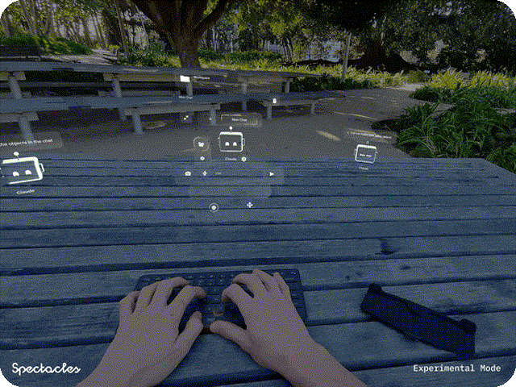
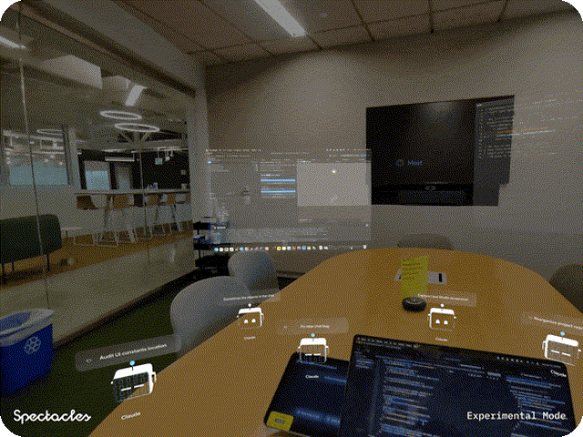
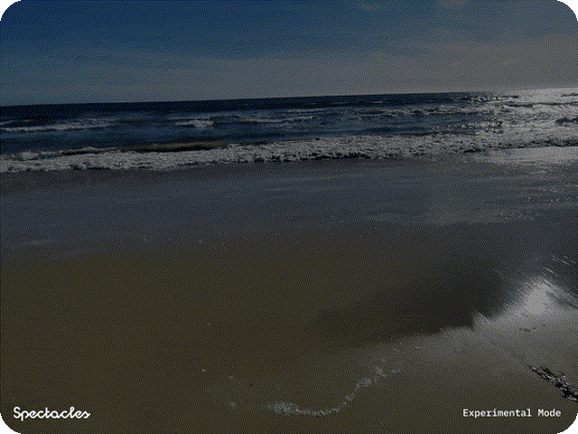

# Agent Manager

[](https://developers.snap.com/spectacles/spectacles-frameworks/spectacles-interaction-kit/features/overview?) [](https://developers.snap.com/spectacles/about-spectacles-features/apis/voice-interaction) [](https://developers.snap.com/spectacles/about-spectacles-features/apis/hand-tracking) [](https://developers.snap.com/spectacles/about-spectacles-features/apis/remoteservice-gateway) [](https://developers.snap.com/spectacles/spectacles-frameworks/spectacles-ui-kit) [](https://developers.snap.com/spectacles/about-spectacles-features/apis/camera-module) [](https://developers.snap.com/spectacles/about-spectacles-features/compatibility-list) [](https://developers.snap.com/spectacles/spectacles-frameworks/supabase/supabase-overview)



## Overview

Agent Manager is a Specs Lens that lets you manage AI coding agents in augmented reality. Chat with agents through text and voice, capture and attach images with hand gestures, and view live agent status as animated robot avatars placed in the world around you.

The system has three components that work together:

- **Lens** (project root, `AgentManager.esproj`) — The AR interface running on Specs
- **Bridge** (`Bridge/`) — A local Node.js daemon on your Mac that manages agent CLI processes
- **Supabase** (`supabase/`) — Cloud backend for auth, realtime messaging, and edge functions

> **NOTE:**
> This project will only work for the Specs platform.

## Design Guidelines

Designing Lenses for Specs offers all-new possibilities to rethink user interaction with digital spaces and the physical world.
Get started using our [Design Guidelines](https://developers.snap.com/spectacles/best-practices/design-for-spectacles/introduction-to-spatial-design)

## Prerequisites

Before you begin, make sure you have the following installed and ready:

| Requirement | Version | Notes |
|---|---|---|
| [Lens Studio](https://ar.snap.com/download?lang=en-US) | v5.15.1+ | Required to open and build the Lens |
| Specs OS | v5.64+ | Update via the Specs companion app |
| Specs App (iOS / Android) | v0.64+ | Needed to push Lenses to the device |
| [Node.js](https://nodejs.org/) | v18+ | Required to run the Bridge daemon |
| [Git LFS](https://git-lfs.github.com/) | Any | Required to clone — large binaries will be missing without it |
| AI CLI | — | At least one of: `claude` (Claude CLI), `codex` (Codex CLI), or a running OpenClaw gateway |

To update your Specs device and mobile app, refer to this [guide](https://support.spectacles.com/hc/en-us/articles/30214953982740-Updating).

## Getting Started

### Step 1 — Clone the Repository

> **IMPORTANT:** This project uses Git Large File Storage (LFS). Downloading a ZIP from GitHub **will not work** — you must clone using a Git client with LFS support. Download Git LFS [here](https://git-lfs.github.com/).

```bash
git lfs install
git clone <repository-url>
cd "Agent Manager"
```

### Step 2 — Set Up the Supabase Backend (Snap Cloud)

Agent Manager requires a [Snap Cloud](https://developers.snap.com/spectacles/about-spectacles-features/snap-cloud/getting-started) Supabase project for authentication and real-time messaging between the Lens and the Bridge. The dashboard for Snap Cloud lives at **[cloud.snap.com](https://cloud.snap.com)** — bookmark it; you'll use it to inspect your project.

First, install the Supabase CLI and log in to Snap Cloud (the `--profile snap` part is required — a plain `supabase login` signs you into public supabase.com, which will not work here):

```bash
brew install supabase/tap/supabase
supabase login --profile snap
```

Then run the interactive setup script:

```bash
cd supabase
./setup.sh
```

The script will:

1. Offer to **create a new Snap Cloud project for you** (or link an existing one — your Project ID is shown in the script's project list, or at [cloud.snap.com](https://cloud.snap.com) under **Settings > General**).
2. Push the database schema, set secrets, and deploy edge functions. Answer **Y** to the prompts along the way — the defaults are what you want.
3. Fetch your anon key automatically and **write `Bridge/.env` for you** — no manual copying of credentials needed. (If you ever need the key yourself, it's at cloud.snap.com under **Settings > API Keys**.)

See [`supabase/README.md`](supabase/README.md) for manual configuration details.

### Step 3 — Start the Bridge

The Bridge is a local Node.js daemon that manages AI agent CLI processes on your Mac and relays messages to and from the Lens via Supabase Realtime. Its `.env` was already written by `setup.sh` in Step 2, so there is nothing to configure:

```bash
cd ../Bridge   # from the supabase/ directory
npm install
node sync.js
```

Use the interactive menu to **add agents**, **configure workspaces** (local project directories), and manage saved connections. A 6-digit pairing code will be displayed — you will use this in Step 5. For full Bridge setup details, see [`Bridge/README.md`](Bridge/README.md).

### Step 4 — Open the Lens in Lens Studio

1. Open **Lens Studio** (v5.15.1 or later).
2. Open the project file: `AgentManager.esproj`.
3. Ensure your Lens Studio environment is set up for Specs — see the [Specs preview guide](https://developers.snap.com/spectacles/get-started/start-building/preview-panel) if you see errors in the Logger Panel.
4. Connect the Lens to your Supabase project from Step 2:
   - Open **Window > Supabase**, sign in, select your project, and click **Import Credentials**. This creates a **SupabaseProject** asset in the Asset Browser.
   - Drag that **SupabaseProject** asset onto the **SnapCloudRequirements** object in the Scene Hierarchy (its **Supabase Project** input). The red in-scene warning disappears once this is set.
5. Set your API token on the **RemoteServiceGatewayCredentials** object (see the [Remote Service Gateway docs](https://developers.snap.com/spectacles/about-spectacles-features/apis/remoteservice-gateway)) to clear the remaining red warning.

**Optional — Test without a backend:** To explore the UI, avatars, and chat flow without running Supabase or the Bridge, set `useMockData` to `true` on the `AgentManagerController` script component in the scene. This uses bundled mock data to simulate agent interactions.

### Step 5 — Deploy to Specs and Pair

> **IMPORTANT — Enable Extended Permissions for voice input.** This Lens uses the camera and the internet, and the OS disables the **microphone** in camera + internet lenses unless Extended Permissions is enabled. Without it, voice input (ASR) silently produces no transcription, and Bluetooth keyboard pairing won't work either. Enable **Experimental APIs** in Lens Studio (Project Settings) and **Extended Permissions** for your device in the Specs mobile app.

1. Connect your Specs device and push the Lens from Lens Studio.
2. Launch the Lens on your Specs.
3. On first launch, an **authentication / pairing screen** appears. For local agents (Claude CLI, Codex CLI, OpenClaw) you do **not** need an API key — just enter the **6-digit pairing code** shown in your Bridge terminal (`node sync.js`). An actual API key is only needed for the Cursor Cloud provider.
4. Once paired, open the **Settings** tab in AR and select your target **workspace** (repository folder) and **AI model**.

### Step 6 — Start Using Agent Manager

With everything connected, you are ready to work with AI agents in AR:

- **Text input** — Type a prompt using the input bar or a paired Bluetooth keyboard. To pair a keyboard, open the **Settings Lens on your Specs** (system settings > Bluetooth), put your keyboard in pairing mode, and select it — once paired it types into Agent Manager automatically.
- **Voice input** — Tap the mic button and speak; on-device ASR transcribes your message hands-free.
- **Image capture** — Frame a subject with a hand gesture to attach a photo to your next prompt.
- **Permission requests** — When an agent needs to write files or run shell commands, a permission popup appears in AR — tap **Allow** or **Deny**.
- **Multi-agent** — Add multiple agents from the Agents tab and switch between them freely.

## Key Features

### Pairing

Before using Agent Manager, you pair the Lens with a Bridge instance using a temporary 6-digit code.

### Sending Messages

Messages flow from the Lens through Supabase to the Bridge, which routes them to the agent CLI and streams the response back in real-time.

### Agent States

Each agent has a real-time status that drives its robot avatar animation and UI indicators.

### Multi-Driver Agent Management

The bridge connects to AI coding agents running locally on your Mac via three built-in drivers:

- **Claude CLI** — spawns `claude` subprocess per conversation with session continuity and MCP permission handling
- **Codex CLI** — spawns `codex` subprocess per conversation with per-workspace session directories
- **OpenClaw** — routes messages to a locally running OpenClaw gateway over HTTP

Each agent appears in AR as an animated robot avatar with real-time status indicators (idle, listening, thinking, working, awaiting permission, error, offline).



### Chat with Text and Voice

Send prompts to agents through a text input bar or by using built-in Automatic Speech Recognition (ASR) for hands-free voice input. Conversations are organized into topics with full message history and markdown rendering.



### Smart Replies

AI-powered prompt suggestions appear in the input bar, offering contextual follow-up actions based on the current conversation. Tap a suggestion to send it instantly.

### Topic Renaming

Conversation topics are automatically renamed using AI to reflect their content, keeping your history organized without manual effort.

### Hand-Gesture Image Capture

Frame a subject with a single- or double-hand gesture to capture and crop a photo, then attach it directly to your next prompt. The crop region follows your hand positions in real time.

### Spatial Agent Avatars

Agents are represented as 3D robot avatars with customizable themes (cat, owl, ghost, axolotl, crt, robot). Drag to reposition or dock them to the management panel.

### Model and Workspace Selection

Choose the AI model and target workspace/repository for each agent directly from the Settings panel in AR.

### Permission Request Flow

Sensitive file and shell operations require your explicit approval. When an agent requests a permission, the lens surfaces a prompt — tap Allow or Deny, and the decision is forwarded to the agent via the bridge's MCP permission server.

### Realtime Updates

Supabase Realtime keeps agent status, messages, and task progress synchronized between the Lens and the bridge with low latency. When the connection drops, the system automatically reconnects and performs a delta sync to catch up on missed messages.

## Project Structure

### Core Scripts

[AgentManagerController.ts](./Assets/Scripts/AgentManagerController.ts): Main entry point. Wires together Supabase, agent providers, UI, and input systems. Handles authentication flow, launching and stopping agents, polling, and mock mode.

[AgentStore.ts](./Assets/Scripts/State/AgentStore.ts): Central state management for agents, topics, messages, tasks, model/repo selection, theme preferences, and persistence.

[UIManager.ts](./Assets/Scripts/UI/UIManager.ts): Builds and coordinates all UI components — the agent world view, input bar, management panel, notifications, and camera hints.

[FramerateManager.ts](./Assets/Scripts/FramerateManager.ts): Dynamic framerate switching — runs at 30fps when idle, escalates to 60fps during animations or active tracking.

[BridgeHeartbeatManager.ts](./Assets/Scripts/BridgeHeartbeatManager.ts): Tracks bridge connection liveness using broadcast channel presence and database heartbeats, reporting online/stale/offline states per agent.

[InstancePollingManager.ts](./Assets/Scripts/InstancePollingManager.ts): Polling loops for cloud-provider agents (e.g., Cursor Cloud) with active and discovery modes.

### Services

[PromptSuggestionService.ts](./Assets/Scripts/Services/PromptSuggestionService.ts): Generates AI-powered smart reply suggestions based on conversation context.

[TopicRenamingService.ts](./Assets/Scripts/Services/TopicRenamingService.ts): Automatically renames conversation topics using AI summaries.

[SmartSummaryService.ts](./Assets/Scripts/Services/SmartSummaryService.ts): Produces summaries used for topic renaming and context awareness.

[PermissionExplainerService.ts](./Assets/Scripts/Services/PermissionExplainerService.ts): Generates plain-English explanations of agent permission requests using recent conversation context.

### Agent Providers

[AgentProvider.ts](./Assets/Scripts/Api/AgentProvider.ts): Interface defining the contract for agent backends (launch, followup, stop, poll, list models/repos).

[BridgeAgentProvider.ts](./Assets/Scripts/Api/Supabase/Bridge/BridgeAgentProvider.ts): Bridge implementation. Communicates with the local bridge daemon via Supabase broadcast channels.

[SupabaseService.ts](./Assets/Scripts/Api/Supabase/SupabaseService.ts): Supabase client wrapper handling authentication, realtime subscriptions, and broadcast channels.

[CursorCloudProvider.ts](./Assets/Scripts/Api/Supabase/Cursor/CursorCloudProvider.ts): Cursor Cloud agent provider. Dispatches commands through the `agent-command` edge function.

### UI Components

[AgentWorldView.ts](./Assets/Scripts/UI/Agent/AgentWorldView.ts): Manages agent avatars in the 3D world — docked vs. free placement, spatial anchors, chat panels, and agent selection.

[AgentObject.ts](./Assets/Scripts/UI/Agent/AgentObject.ts): Individual agent avatar with robot visuals, status animations, settings, pin/close actions, and drag/detach behavior.

[AgentButton.ts](./Assets/Scripts/UI/Agent/AgentButton.ts): Individual agent button in the button bar, displaying a robot avatar with status coloring.

[AgentManagerPanel.ts](./Assets/Scripts/UI/AgentManagerPanel.ts): Main panel with Agents and Settings tabs, agent list, authentication views, and slide-in/out animations.

[AgentInputBar.ts](./Assets/Scripts/UI/AgentInputBar.ts): Input bar with text entry, mic toggle, camera capture, send/stop controls, positioned near the selected agent.

[AgentChatPanel.ts](./Assets/Scripts/UI/Chat/AgentChatPanel.ts): Chat panel displaying conversation history with markdown-rendered message bubbles.

[ChatSettingsPanel.ts](./Assets/Scripts/UI/Chat/ChatSettingsPanel.ts): Per-conversation settings including workspace/model selection and topic management.

[SuggestionBar.ts](./Assets/Scripts/UI/Input/SuggestionBar.ts): Horizontal scrollable bar of AI-generated smart reply suggestions.

[ImagePreviewBar.ts](./Assets/Scripts/UI/Input/ImagePreviewBar.ts): Thumbnail strip showing captured images queued for the next message, with animated attachment and removal.

[InputBarController.ts](./Assets/Scripts/UI/Input/InputBarController.ts): Orchestrates the input bar layout — text field, mic toggle, camera capture, send/stop buttons, image preview, and Bluetooth keyboard integration.

[WrappingTextInput.ts](./Assets/Scripts/UI/Input/WrappingTextInput.ts): Multi-line text input with automatic line wrapping, placeholder text, and Bluetooth keyboard support.

[ChatSelectorObject.ts](./Assets/Scripts/UI/Chat/ChatSelectorObject.ts): Topic and conversation selector with collapsible sections, new-topic creation, and notification badges.

[PermissionRequestView.ts](./Assets/Scripts/UI/Chat/PermissionRequestView.ts): Displays pending MCP permission requests with Allow/Deny controls.

### Input Systems

[VoiceInputController.ts](./Assets/Scripts/Input/VoiceInputController.ts): Automatic Speech Recognition (ASR) controller for converting voice to text input.

[CaptureController.ts](./Assets/Scripts/CaptureGesture/Controllers/CaptureController.ts): Hand-gesture image capture system supporting single- and double-hand crop gestures with real-time frame preview.

### Views

[AuthView.ts](./Assets/Scripts/UI/Views/AuthView.ts): Authentication and pairing code entry screen with input field, submit button, and status feedback.

[SettingsListView.ts](./Assets/Scripts/UI/Views/SettingsListView.ts): Main settings panel listing paired agents, smart feature toggles, and Bluetooth keyboard pairing.

[SettingsSelectionView.ts](./Assets/Scripts/UI/Views/SettingsSelectionView.ts): Drill-in selection view for choosing a model, workspace, or theme from a scrollable option list.

[BluetoothScanView.ts](./Assets/Scripts/UI/Views/BluetoothScanView.ts): Bluetooth device scanning and pairing view with scanning, idle, and connecting states.

[AgentsLoadingView.ts](./Assets/Scripts/UI/Views/AgentsLoadingView.ts): Loading spinner shown while agents are being fetched.

[AgentsEmptyView.ts](./Assets/Scripts/UI/Views/AgentsEmptyView.ts): Empty state shown when no agents are paired.

[NoInternetView.ts](./Assets/Scripts/UI/Views/NoInternetView.ts): Offline warning shown when the device loses internet connectivity.

### Shared UI (`UI/Shared/`)

Reusable building blocks shared across all UI components:

[DirtyComponent.ts](./Assets/Scripts/UI/Shared/DirtyComponent.ts): Base class for UI components using a deferred dirty-flag update pattern with optional per-frame tracking.

[UIAnimations.ts](./Assets/Scripts/UI/Shared/UIAnimations.ts): Animation utilities — scale in/out, wipe transitions, opacity snapshot and multiplier helpers.

[UIBuilders.ts](./Assets/Scripts/UI/Shared/UIBuilders.ts): Factory functions for common UI primitives (buttons, tooltips, text labels, scroll bars).

[DialogueObject.ts](./Assets/Scripts/UI/Shared/DialogueObject.ts): Reusable confirmation/action dialogue with title, body, and button controls.

Also contains: `UIConstants.ts` (layout constants and status colors), `TextSizes.ts` (font sizes and font asset references), `RobotTypes.ts` (robot state and theme type definitions), `ImageFactory.ts` (cached material creation for image elements), `CloneControlsBuilder.ts` (close/hover controls for detached panels).

### Bluetooth

> **Note:** Bluetooth requires the Experimental API to be enabled in Lens Studio and Extended Permissions to be enabled on the mobile app.
>
> **Pairing an external keyboard — use the Settings Lens on Specs 27.** Open the **Settings Lens** on your Specs, go to **Bluetooth**, put your keyboard in pairing mode (make sure it isn't still bonded to your laptop/phone — "forget" it there first), and select it from the list. Once paired at the system level, it types into Agent Manager automatically.
>
> **Why there is no in-lens pairing:** the [Lens Bluetooth API](https://developers.snap.com/spectacles/about-spectacles-features/apis/bluetooth) is GATT-client only and **does not support HID (input) devices** — keyboards require system-level bonding a lens cannot perform, and a keyboard already bonded to the system stops advertising, so an in-lens scan would never see it. The in-lens scan/pair UI is therefore hidden behind the `SHOW_BLUETOOTH_SECTION` flag in `SettingsListView.ts`; the BLE scripts (`BLEKeyboardManager`, `BluetoothScanView`) are kept as a GATT example for when the platform supports it. Also note the API docs state that accessing Bluetooth GATT in a lens disables camera frame, location, and audio access unless Extended Permissions is enabled (which is why the module is only loaded on demand).

[BLEKeyboardManager.ts](./Assets/Scripts/Bluetooth/BLEKeyboardManager.ts): BLE GATT keyboard manager — scans for HID devices, pairs, and translates HID key reports into keyboard events with modifier support.

[HIDKeyCodes.ts](./Assets/Scripts/Bluetooth/HIDKeyCodes.ts): HID usage ID to character mapping tables including shift-modified characters.

### Utils

[CameraService.ts](./Assets/Scripts/Utils/CameraService.ts): Singleton camera access service — texture capture, crop regions, and virtual camera setup.

[TextureEncoding.ts](./Assets/Scripts/Utils/TextureEncoding.ts): Async Base64 encode/decode helpers for Texture objects (PNG format).

[MarkdownUtils.ts](./Assets/Scripts/Utils/MarkdownUtils.ts): Strips markdown formatting (code fences, bold, italic, links, lists) for plain-text display.

[BillboardBehavior.ts](./Assets/Scripts/Utils/BillboardBehavior.ts): Billboarding logic that rotates a SceneObject to face the camera on the horizontal plane with smoothed snapping.

### Bridge (`Bridge/`)

See [`Bridge/README.md`](Bridge/README.md) for full documentation. Key files:

- `sync.js` — main entry point, Supabase integration, message routing
- `drivers/claude-cli.js` — Claude CLI driver
- `drivers/codex-cli.js` — Codex CLI driver
- `drivers/openclaw.js` — OpenClaw HTTP driver
- `mcp-permission-server.js` — MCP server for routing permission requests to the lens
- `mcp-artifacts-server.js` — MCP server for screen sharing and visual artifacts

## Testing the Lens

### In Lens Studio Editor

Open the project in Lens Studio. To test without backend services, enable `useMockData` on the `AgentManagerController` component. This simulates agent interactions using mock data, allowing you to explore the UI, avatar system, and chat flow without needing Supabase or a running bridge.

### On Specs Device

1. Start the bridge: `cd Bridge && node sync.js`
2. Build and deploy the Lens to your Specs device
3. Pair the lens with your bridge agent using the pairing code shown in `sync.js`
4. Select a workspace and model from the Settings tab
5. Send prompts via text or voice; approve/deny any permission requests that appear
6. Use hand gestures to capture and attach images to your prompts
7. Drag agent avatars to reposition them in the world

## Support

If you have any questions or need assistance, please don't hesitate to reach out. Our community is here to help, and you can connect with us and ask for support [here](https://www.reddit.com/r/Spectacles/). We look forward to hearing from you and are excited to assist you on your journey!

## Contributing

Feel free to provide improvements or suggestions or directly contributing via merge request. By sharing insights, you help everyone else build better Lenses.

---*Maintained with 👽 by the SPECS Team*

---

​

​

​

​

​
