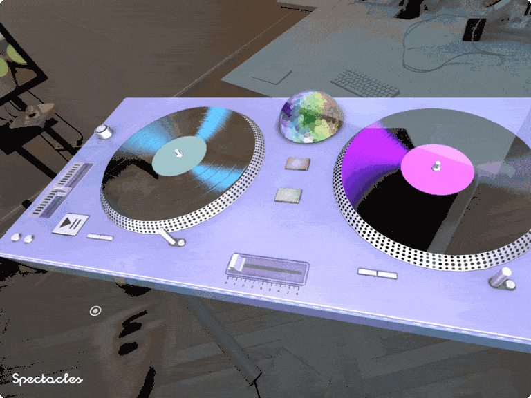

# DJ Specs

  

## Overview

DJ Specs is an interactive DJ turntable experience built for Spectacles that lets users scratch vinyl records, mix audio tracks, and control playback using hand tracking. It demonstrates real-time audio manipulation, physics-based vinyl rotation, and dual-deck mixing using the Spectacles hand-tracking API. Learn more about the Spectacles audio output API [here](https://developers.snap.com/lens-studio/features/audio/audio-output#guide).

> **NOTE**: This project will only work for the Spectacles platform.

## Design Guidelines

Designing Lenses for Spectacles offers all-new possibilities to rethink user interaction with digital spaces and the physical world.
Get started using our [Design Guidelines](https://developers.snap.com/spectacles/best-practices/design-for-spectacles/introduction-to-spatial-design)

## Prerequisites

- **Lens Studio**: v5.15.4+

**Note:** Ensure Lens Studio is [compatible with Spectacles](https://ar.snap.com/download) for your Spectacles device and OS versions.

- **Spectacles OS Version**: v5.64+
- **Spectacles App iOS**: v0.64+
- **Spectacles App Android**: v0.64+

To update your Spectacles device and mobile app, please refer to this [guide](https://support.spectacles.com/hc/en-us/articles/30214953982740-Updating).

You can download the latest version of Lens Studio from [here](https://ar.snap.com/download?lang=en-US).

The hand tracking features require you to use Experimental APIs. Please see Experimental APIs for more details [here](https://developers.snap.com/spectacles/about-spectacles-features/apis/experimental-apis).

Extended Permissions mode on device must be enabled for enabling some of the Spectacles APIs. Please see Extended Permissions for more details [here](https://developers.snap.com/spectacles/permission-privacy/extended-permissions).

## Getting Started

To obtain the project folder, clone the repository.

> **IMPORTANT:**
> This project uses Git Large Files Support (LFS). Downloading a zip file using the green button on GitHub **will not work**. You must clone the project with a version of git that has LFS.
> You can download Git LFS [here](https://git-lfs.github.com/).

## Initial Project Setup

The project should be pre-configured to get you started without any additional steps. However, if you encounter issues in the Logger Panel, please ensure your Lens Studio environment is set up for [Spectacles](https://developers.snap.com/spectacles/get-started/start-buiding/preview-panel).

## Key Script

[AudioController.ts](./Assets/Scripts/FloatArrayWrapper/AudioController.ts) - Manages dual-deck real-time audio playback with variable speed and volume control via buffered FloatArrayWrapper streams.

[VinylRotator.ts](./Assets/Scripts/FloatArrayWrapper/VinylRotator.ts) - Drives physics-based vinyl rotation with inertia decay, hand-tracking input, and smooth tween-based pause/resume transitions.

[HandController.ts](./Assets/Scripts/FloatArrayWrapper/HandController.ts) - Tracks the closest hand relative to the vinyl center to derive rotation direction and speed for scratching.

[VinylInteraction.ts](./Assets/Scripts/FloatArrayWrapper/VinylInteraction.ts) - Handles dragging the movable vinyl disc onto the left or right deck with lerp snapping and color-coded visual feedback.

[VolumeController.ts](./Assets/Scripts/FloatArrayWrapper/VolumeController.ts) - Provides a crossfade setVolume() method that balances audio between deck 1 and deck 2.

[TweenManager.ts](./Assets/Scripts/TweenManager/TweenManager.ts) - Drives the TWEEN engine each frame and exposes the global tweenManager API for starting, stopping, pausing, and resuming tweens.

## Testing the Lens

### In Lens Studio Editor

1. Open the project file `DJSpecs.esproj` in Lens Studio 5.15.4+.
2. Open the Preview panel and select a Spectacles device preview configuration.
3. Verify that all audio tracks appear in the track selection menu on the left.
4. Use the simulated hand-tracking controls to test vinyl rotation and deck snapping.

### In Spectacles Device

1. Build and push the lens to your Spectacles device from Lens Studio.
2. Follow the [Spectacles preview guide](https://developers.snap.com/spectacles/get-started/start-buiding/preview-panel) for device deployment.
3. Enable Extended Permissions on device so hand tracking can access the required APIs.
4. Drag a vinyl disc from the track list onto a deck, then move your hand over the vinyl to scratch.
5. Use both decks simultaneously to mix two tracks with the crossfader.

## Support

If you have any questions or need assistance, please don't hesitate to reach out. Our community is here to help, and you can connect with us and ask for support [here](https://www.reddit.com/r/Spectacles/). We look forward to hearing from you and are excited to assist you on your journey!

## Contributing

Feel free to provide improvements or suggestions or directly contributing via merge request. By sharing insights, you help everyone else build better Lenses.

---

*Built with <3 by the Spectacles team*

---
