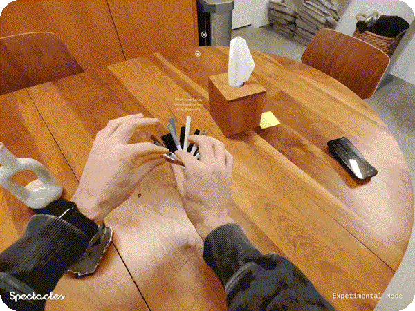
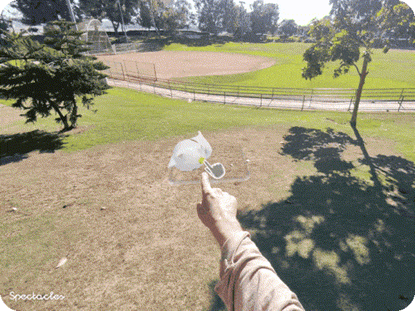
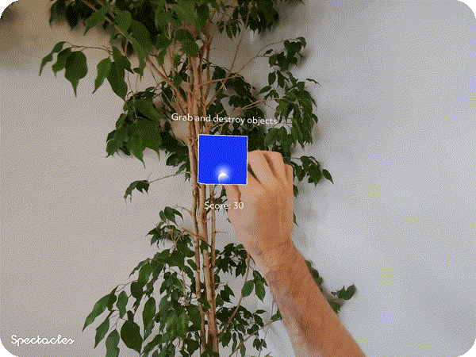

# Specs Samples

A comprehensive collection of templates and examples for building Lens experiences on Specs.

> [!IMPORTANT]
> **This `main` branch targets SPECS 27 with Lens Studio 5.22.0+ and will NOT work with Spectacles (2024).**
> For Spectacles (2024) development, switch to the [`5.15.4` branch](https://github.com/specs-devs/samples/tree/5.15.4) or download the [`5.15.4` release](https://github.com/specs-devs/samples/releases/tag/5.15.4) zip.

## What you'll find here

This repository contains multiple template projects showcasing different features and capabilities available when building for Specs. Each template is a complete, working example that you can use as a starting point for your own projects.

## Prerequisites

### Git LFS Required

**This repository requires Git LFS (Large File Storage) to be installed and configured.** The templates contain large assets including 3D models, textures, images, and media files that are tracked using Git LFS.

#### Installing Git LFS

**macOS (using Homebrew):**
```bash
brew install git-lfs
```

**Windows:**
Download and install from [git-lfs.github.com](https://git-lfs.github.com/)

**Linux:**
```bash
# Debian/Ubuntu
sudo apt-get install git-lfs

# Fedora/Red Hat
sudo dnf install git-lfs
```

#### Setting Up Git LFS

After installing Git LFS, you need to set it up:

```bash
git lfs install
```

#### Cloning This Repository

When cloning this repository, Git LFS will automatically download the large files:

```bash
git clone <repository-url>
cd samples
```

If you've already cloned the repository without Git LFS installed, you can fetch the LFS files:

```bash
git lfs install
git lfs pull
```

#### Verifying Git LFS

To verify that Git LFS is working correctly:

```bash
git lfs ls-files
```

This will show you all files tracked by Git LFS.

## AI

AI-powered experiences and integrations

<table>
  <tr>
    <td align="center" valign="top" width="33%">
      <a href="./AI Playground/">
        
      </a>
      <h3>AI Playground</h3>
      <p>
<a href="https://developers.snap.com/spectacles/spectacles-frameworks/spectacles-interaction-kit/features/overview?">
  
</a>
<a href="https://developers.snap.com/spectacles/about-spectacles-features/overview">
  
</a>
<a href="https://developers.snap.com/spectacles/about-spectacles-features/compatibility-list">
  
</a>
<a href="https://developers.snap.com/spectacles/about-spectacles-features/compatibility-list">
  
</a>
<a href="https://developers.snap.com/spectacles/about-spectacles-features/apis/camera-module?">
  
</a>
<a href="https://developers.snap.com/spectacles/about-spectacles-features/compatability-list">
  
</a>
<a href="https://developers.snap.com/spectacles/about-spectacles-features/compatibility-list">
  
</a>
<a href="https://developers.snap.com/spectacles/about-spectacles-features/compatibility-list">
  
</a>
<a href="https://developers.snap.com/lens-studio/features/audio/playing-audio?">
  
</a>
      </p>
      <p>Sample project for AI in using Specs Remote Service Gateway.</p>
    </td>
<td align="center" valign="top" width="33%">
      <a href="./Crop/">
        
      </a>
      <h3>Crop</h3>
      <p>
<a href="https://developers.snap.com/spectacles/spectacles-frameworks/spectacles-interaction-kit/features/overview?">
  
</a>
<a href="https://developers.snap.com/spectacles/about-spectacles-features/overview">
  
</a>
<a href="https://developers.snap.com/spectacles/about-spectacles-features/apis/experimental-apis?">
  
</a>
<a href="https://developers.snap.com/spectacles/about-spectacles-features/compatibility-list">
  
</a>
<a href="https://developers.snap.com/spectacles/about-spectacles-features/compatibility-list">
  
</a>
<a href="https://developers.snap.com/spectacles/about-spectacles-features/apis/camera-module?">
  
</a>
<a href="https://developers.snap.com/spectacles/about-spectacles-features/compatability-list">
  
</a>
<a href="https://developers.snap.com/spectacles/about-spectacles-features/compatibility-list">
  
</a>
<a href="https://developers.snap.com/spectacles/about-spectacles-features/compatibility-list">
  
</a>
<a href="https://developers.snap.com/spectacles/about-spectacles-features/apis/fetch?">
  
</a>
<a href="https://developers.snap.com/spectacles/about-spectacles-features/apis/web-view?">
  
</a>
<a href="https://developers.snap.com/spectacles/about-spectacles-features/apis/gesture-module?">
  
</a>
      </p>
      <p>Sample project showing how to "crop" the environment using hand gesture.</p>
    </td>
  </tr>
  <tr>
    <td align="center" valign="top" width="33%">
      <a href="./Depth Cache/">
        
      </a>
      <h3>Depth Cache</h3>
      <p>
<a href="https://developers.snap.com/spectacles/spectacles-frameworks/spectacles-interaction-kit/features/overview?">
  
</a>
<a href="https://developers.snap.com/spectacles/about-spectacles-features/overview">
  
</a>
<a href="https://developers.snap.com/spectacles/about-spectacles-features/apis/asr-module">
  
</a>
<a href="https://developers.snap.com/spectacles/spectacles-frameworks/spectacles-interaction-kit/features/overview?">
  
</a>
<a href="https://developers.snap.com/lens-studio/features/ar-tracking/world/world-mesh-and-depth-texture">
  
</a>
<a href="https://developers.snap.com/spectacles/spectacles-frameworks/spectacles-interaction-kit/features/overview?">
  
</a>
<a href="https://developers.snap.com/spectacles/spectacles-frameworks/spectacles-interaction-kit/features/overview?">
  
</a>
      </p>
      <p>Cache depth frames for pixel-to-3D projection with cloud-based vision models.</p>
    </td>
    <td align="center" valign="top" width="33%">
      <a href="./AI Music Gen/">
        
      </a>
      <h3>AI Music Gen</h3>
      <p>
<a href="https://developers.snap.com/spectacles/spectacles-frameworks/spectacles-interaction-kit/features/overview?">
  
</a>
<a href="https://developers.snap.com/spectacles/about-spectacles-features/overview">
  
</a>
<a href="https://developers.snap.com/spectacles/about-spectacles-features/compatibility-list">
  
</a>
<a href="https://developers.snap.com/spectacles/about-spectacles-features/compatibility-list">
  
</a>
<a href="https://developers.snap.com/spectacles/about-spectacles-features/apis/snap3d">
  
</a>
<a href="https://developers.snap.com/spectacles/about-spectacles-features/compatibility-list">
  
</a>
<a href="https://developers.snap.com/lens-studio/features/audio/playing-audio?">
  
</a>
<a href="https://developers.snap.com/spectacles/spectacles-frameworks/spectacles-ui-kit">
  
</a>
      </p>
      <p>Generate AI music using Google's Lyria model. Combine genres, vibes, and instruments to create custom music tracks with 3D visualizations.</p>
    </td>
    <td align="center" valign="top" width="33%">
      <a href="./Agent Manager/">
        
      </a>
      <h3>Agent Manager</h3>
      <p>
<a href="https://developers.snap.com/spectacles/spectacles-frameworks/spectacles-interaction-kit/features/overview?">
  
</a>
<a href="https://developers.snap.com/spectacles/about-spectacles-features/overview">
  
</a>
<a href="https://developers.snap.com/spectacles/about-spectacles-features/compatibility-list">
  
</a>
<a href="https://developers.snap.com/spectacles/about-spectacles-features/compatibility-list">
  
</a>
<a href="https://developers.snap.com/spectacles/about-spectacles-features/compatibility-list">
  
</a>
      </p>
      <p>Multi-agent assistant hub for Specs—run and manage multiple AI agents with text and voice input.</p>
    </td>
  </tr>
</table>


## Getting Started

Essential projects to get you started with Specs development

<table>
  <tr>
    <td align="center" valign="top" width="33%">
      <a href="./Fetch/">
        
      </a>
      <h3>Fetch</h3>
      <p>
<a href="https://developers.snap.com/spectacles/spectacles-frameworks/spectacles-interaction-kit/features/overview?">
  
</a>
<a href="https://developers.snap.com/spectacles/about-spectacles-features/apis/experimental-apis?">
  
</a>
<a href="https://developers.snap.com/spectacles/about-spectacles-features/apis/fetch?">
  
</a>
<a href="https://developers.snap.com/spectacles/about-spectacles-features/apis/web-view?">
  
</a>
      </p>
      <p>Sample project using the Specs Fetch API.</p>
    </td>
    <td align="center" valign="top" width="33%">
      <a href="./Essentials/">
        
      </a>
      <h3>Essentials</h3>
      <p>
<a href="https://developers.snap.com/spectacles/spectacles-frameworks/spectacles-interaction-kit/features/overview?">
  
</a>
<a href="https://developers.snap.com/lens-studio/features/physics/physics-overview?">
  
</a>
<a href="https://developers.snap.com/spectacles/about-spectacles-features/apis/gesture-module?">
  
</a>
<a href="https://developers.snap.com/lens-studio/api/lens-scripting/modules/Packages_LSTween_LSTween.html?">
  
</a>
<a href="https://developers.snap.com/lens-studio/api/lens-scripting/classes/Built-In.RayCastHit.html">
  
</a>
      </p>
      <p>Collection of foundational concepts for creating lenses in Lens Studio.</p>
    </td>
    <td align="center" valign="top" width="33%">
      <a href="./Spatial Image/">
        
      </a>
      <h3>Spatial Image</h3>
      <p>
<a href="https://developers.snap.com/spectacles/spectacles-frameworks/spectacles-interaction-kit/features/overview?">
  
</a>
<a href="https://developers.snap.com/spectacles/about-spectacles-features/apis/spatial-image?">
  
</a>
      </p>
      <p>Convert your 2D images to 3D.</p>
    </td>
  </tr>
  <tr>
    <td align="center" valign="top" width="33%">
      <a href="./Throw Lab/">
        
      </a>
      <h3>Throw Lab</h3>
      <p>
<a href="https://developers.snap.com/spectacles/spectacles-frameworks/spectacles-interaction-kit/features/overview?">
  
</a>
<a href="https://developers.snap.com/lens-studio/features/physics/physics-overview?">
  
</a>
<a href="https://developers.snap.com/spectacles/about-spectacles-features/apis/gesture-module?">
  
</a>
      </p>
      <p>Sample project demonstrating realistic throwing mechanics in AR.</p>
    </td>
    <td align="center" valign="top" width="33%">
      <a href="./Voice Playback/">
        
      </a>
      <h3>Voice Playback</h3>
      <p>
<a href="https://developers.snap.com/spectacles/spectacles-frameworks/spectacles-interaction-kit/features/overview?">
  
</a>
<a href="https://developers.snap.com/lens-studio/features/audio/playing-audio?">
  
</a>
      </p>
      <p>Sample project for recording and playing back audio on Specs.</p>
    </td>
    <td align="center" valign="top" width="33%">
      <a href="./Path Pioneer/">
        
      </a>
      <h3>Path Pioneer</h3>
      <p>
<a href="https://developers.snap.com/spectacles/spectacles-frameworks/spectacles-interaction-kit/features/overview?">
  
</a>
<a href="https://developers.snap.com/lens-studio/api/lens-scripting/classes/Built-In.RayCastHit.html">
  
</a>
<a href="https://developers.snap.com/lens-studio/features/graphics/materials/overview">
  
</a>
      </p>
      <p>Sample project for path creation and path walking experience.</p>
    </td>
  </tr>
  <tr>
    <td align="center" valign="top" width="33%">
      <a href="./Specs Mobile Kit/">
        
      </a>
      <h3>Specs Mobile Kit</h3>
      <p>
<a href="https://developers.snap.com/spectacles/spectacles-frameworks/spectacles-mobile-kit/getting-started">
  
</a>
      </p>
      <p>SDK for seamless communication between mobile applications and Lenses running on Specs via BLE.</p>
    </td>
    <td align="center" valign="top" width="33%">
      <a href="./DJ Specs/">
        
      </a>
      <h3>DJ Specs</h3>
      <p>
<a href="https://developers.snap.com/spectacles/spectacles-frameworks/spectacles-interaction-kit/features/overview?">
  
</a>
<a href="https://developers.snap.com/lens-studio/features/audio/playing-audio?">
  
</a>
<a href="https://developers.snap.com/spectacles/about-spectacles-features/apis/hand-tracking">
  
</a>
<a href="https://developers.snap.com/lens-studio/features/physics/physics-overview?">
  
</a>
      </p>
      <p>Interactive DJ turntable experience with realistic vinyl physics and multi-track audio mixing.</p>
    </td>
    <td></td>
  </tr>
</table>

## Navigation

Location-based and navigation experiences

<table>
  <tr>
    <td align="center" valign="top" width="33%">
      <a href="./Custom Locations/">
        
      </a>
      <h3>Custom Locations</h3>
      <p>
<a href="https://developers.snap.com/spectacles/spectacles-frameworks/spectacles-interaction-kit/features/overview?">
  
</a>
<a href="https://developers.snap.com/spectacles/about-spectacles-features/apis/custom-locations">
  
</a>
      </p>
      <p>Map real life areas and create AR experiences around those locations.</p>
    </td>
    <td align="center" valign="top" width="33%">
      <a href="./Navigation Kit/">
        
      </a>
      <h3>Navigation Kit</h3>
      <p>
<a href="https://developers.snap.com/spectacles/spectacles-frameworks/spectacles-interaction-kit/features/overview?">
  
</a>
<a href="https://developers.snap.com/lens-studio/features/location-ar/custom-landmarker?">
  
</a>
<a href="https://developers.snap.com/spectacles/about-spectacles-features/compatability-list?">
  
</a>
<a href="https://developers.snap.com/lens-studio/features/location-ar/map-component?">
  
</a>
<a href="https://developers.snap.com/lens-studio/features/remote-apis/snap-places-api?">
  
</a>
      </p>
      <p>An example project for indoors or outdoors navigation.</p>
    </td>
    <td></td>
  </tr>
</table>

## Connected Lenses

Multi-user collaborative experiences

<table>
  <tr>
    <td align="center" valign="top" width="33%">
      <a href="./Sync Kit Basic Example/">
        
      </a>
      <h3>Specs Sync Kit</h3>
      <p>
<a href="https://developers.snap.com/spectacles/spectacles-frameworks/spectacles-sync-kit">
  
</a>
<a href="https://developers.snap.com/spectacles/spectacles-frameworks/spectacles-interaction-kit/features/overview?">
  
</a>
<a href="https://developers.snap.com/spectacles/about-spectacles-features/connected-lenses/overview?">
  
</a>
<a href="https://developers.snap.com/spectacles/about-spectacles-features/connected-lenses/overview?">
  
</a>
<a href="https://developers.snap.com/lens-studio/features/lens-cloud/lens-cloud-overview?">
  
</a>
      </p>
      <p>Minimal example of Specs Sync Kit transform synchronization across Connected Lenses.</p>
    </td>
    <td></td>
    <td></td>
  </tr>
</table>

## Snap Cloud

Cloud-powered experiences using Snap Cloud (powered by Supabase)

<table>
  <tr>
    <td align="center" valign="top" width="33%">
      <a href="./Snap Cloud World Kindness Day/">
        
      </a>
      <h3>Snap Cloud World Kindness Day</h3>
      <p>
<a href="https://developers.snap.com/spectacles/spectacles-frameworks/spectacles-interaction-kit/features/overview?">
  
</a>
<a href="https://cloud.snap.com">
  
</a>
<a href="https://developers.snap.com/spectacles/about-spectacles-features/apis/asr-module">
  
</a>
<a href="https://developers.snap.com/spectacles/about-spectacles-features/apis/gesture-module?">
  
</a>
      </p>
      <p>Demonstrating Snap Cloud integration with real-time database updates and a companion web app.</p>
    </td>
    <td></td>
    <td></td>
  </tr>
</table>

## Templates

Blank starting points for building new projects from scratch.

| Template | Path | Description |
| :--- | :--- | :--- |
| Specs Base Template | `Specs Base Template/` | Minimal empty project — start here for a clean slate. |
| Specs Base Template With Examples | `Specs Base Template With Examples/` | Base template pre-populated with example content to build on. |

## Additional Resources

- **[Specs Developer Documentation](https://developers.snap.com/spectacles)** - Complete guides and API references
- **[Design Guidelines](https://developers.snap.com/spectacles/best-practices/design-for-spectacles/introduction-to-spatial-design)** - Best practices for Specs design
- **[Lens Studio](https://ar.snap.com/lens-studio)** - Download the latest version of Lens Studio
- **[Community Forum](https://www.reddit.com/r/Spectacles/)** - Connect with other developers and get support

## Getting Started

1. **Install Git LFS** (see [Prerequisites](#prerequisites) section above)
2. **Clone this repository** with Git LFS enabled
3. **Open any project folder** in Lens Studio
4. **Explore the templates** and start building!

> ⚠️ **Important:** Make sure Git LFS is installed before cloning, otherwise large assets won't download correctly.

## Contributing

We welcome contributions on existing project! Feel free to submit pull requests or open issues.

---*Maintained with 👽 by the SPECS Team*


